# **Reja**

- [x] [Timeweb](https://timeweb.cloud/vds?utm_source=cp30907&utm_medium=timeweb&utm_campaign=timeweb-bring-a-friend) sayti orqali pullik VDS & VPS server sotib olish va unga o'z loyihalarimizni yuklashimiz mumkin!

1. **Timeweb** saytidan hisob(аккаунт) yaratish
2. **Timeweb** hisobimiz(аккаунт) -ni QIWI orqali to'ldirish
3. **Ubuntu** server olish
4. **PuTTY** orqali serverga bog'lanish
5. **WinSCP** orqali serverga bog'lanish
6. **Loyiha** - ni yuklash va Serverni Sozlash
   - **Loyiha** - ni server uchun tayyorlash.
   - **PuTTY** va **WinSCP** orali loyihani serverga yuklash.

# _Timeweb_ saytidan profil ochish sayt manzili >>> [Timeweb](https://timeweb.cloud/vds?utm_source=cp30907&utm_medium=timeweb&utm_campaign=timeweb-bring-a-friend)

> _Hisob_ yaratishdan boshlang! VDS и VPS bo'limini tanlang va ro'yxatdan o'ting!

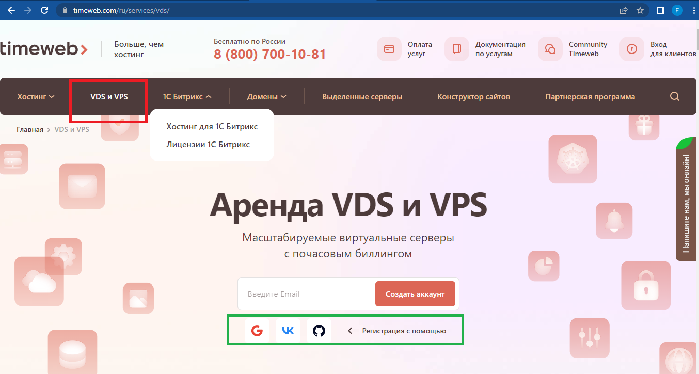

> _Server yaratishni boshlang Ubuntu tanlang va albatta versiyasini Tanlang xozirda 22.04 so'nggi versiya!_ > 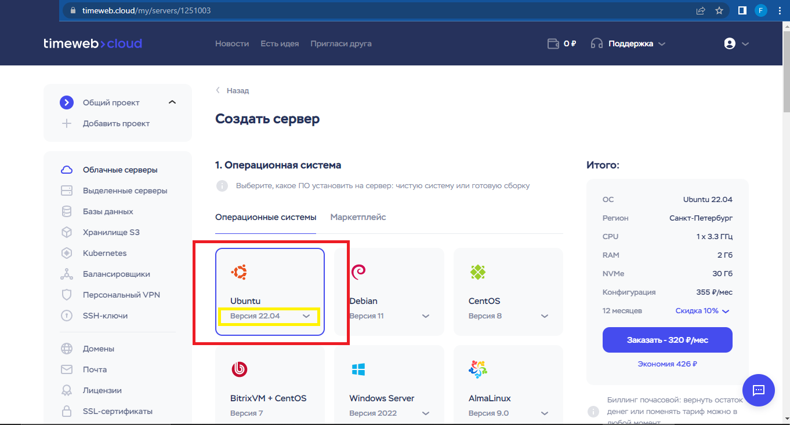

> _Kerakli oylik paketini tanlang! 188 rubl botlar uchun yetarli _ > 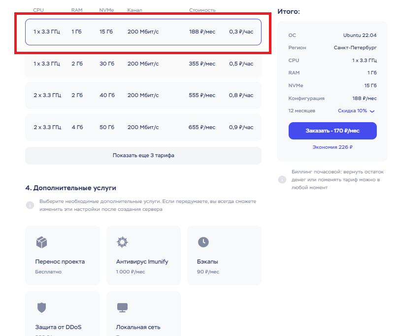

> _Rasmdagi sozlamalarni sozlang va boshqa sozlamalarni belgilasangiz qo'shimcha pul oylik tulovingizga qo'shiladi!_ > 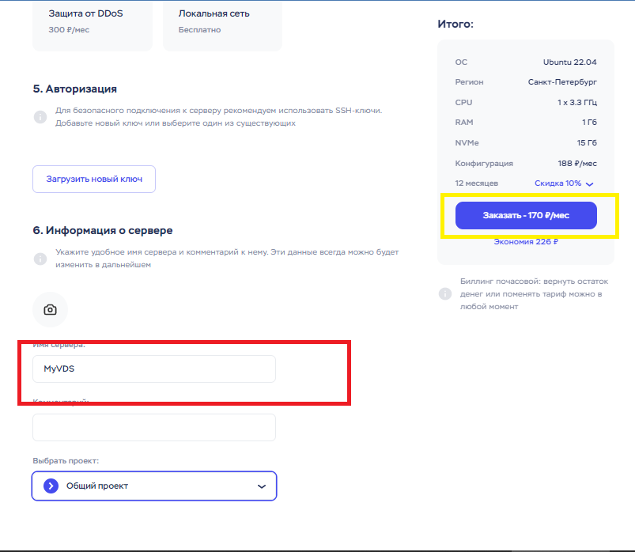

> _Server sozlamalarini tugatishingiz bilan siz tulov qilishingiz kerak! Rasmda QIWI orqali to'lov amalga oshirilgan_ > _QIWI_ dan profil ochgan bo'lishingiz kerak yoki _VISA_ orqali tulovni amalga oshirishingiz ham mumkin!

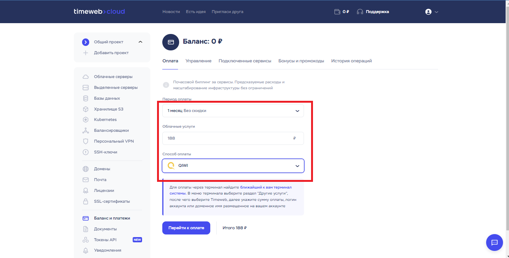

> _QIWI profil telefon raqamingizni kiriting va Tulovni amalga amalga oshiring!_

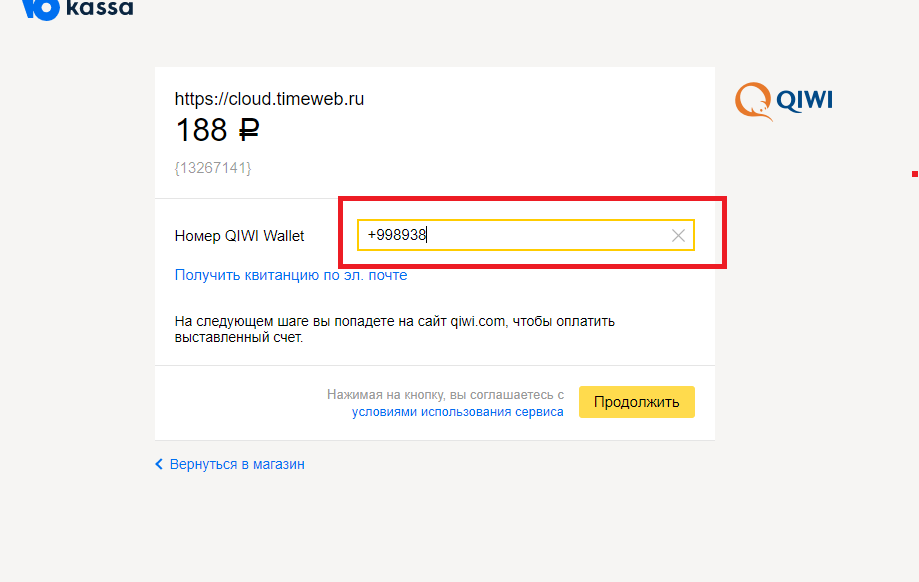

> _Sotib olgan serverni ko'rishingiz mumkin_

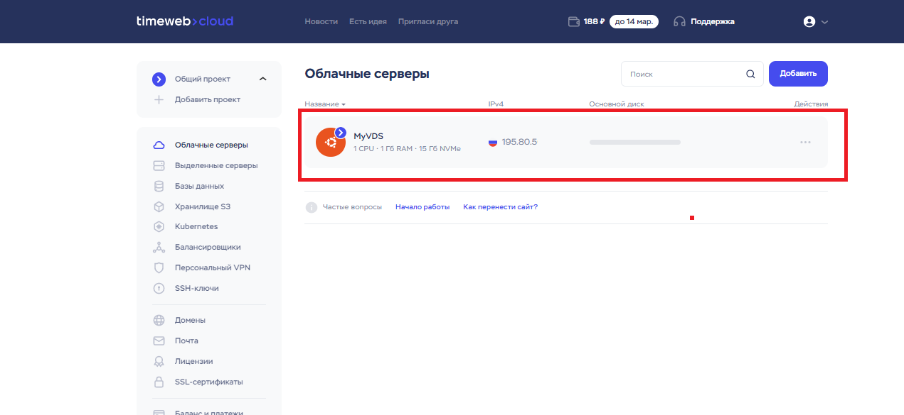

> *Rasmda ko'rsatilgan joyda sizning IP manzilingiz bo'ladi kopiya oling va *PuTTY\* dasturini oching

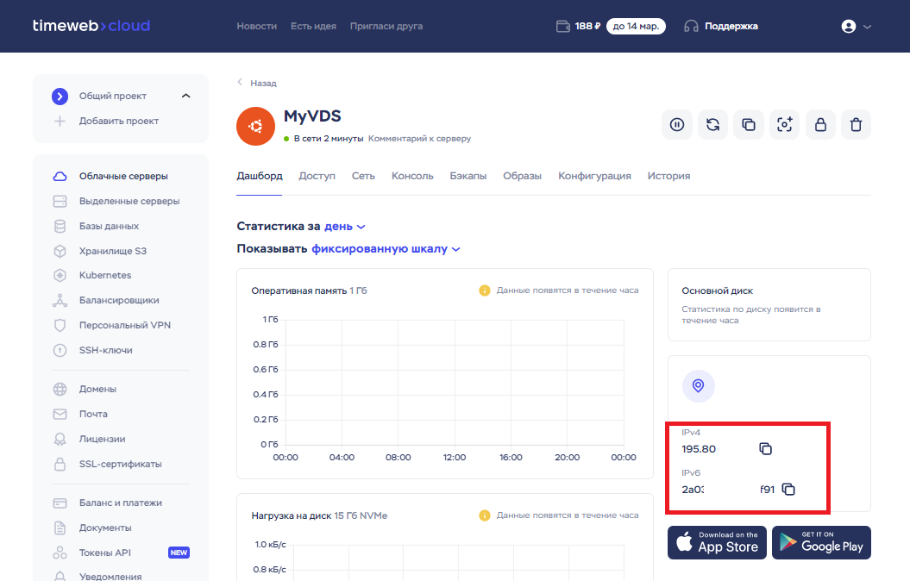

> _IP manzilingizni joylashtiring va serverni nomlang!_

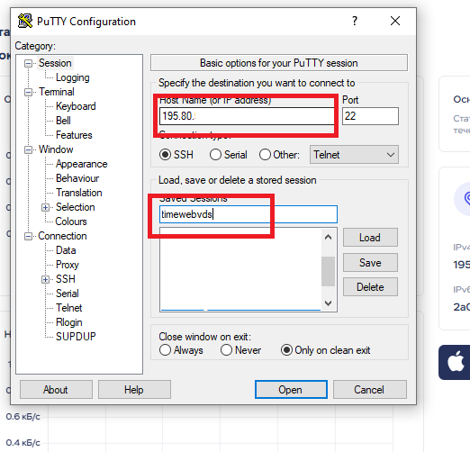

# *Gmailingizga xabar yuboriladi u xabarda sizning IP manzilingiz va *Parolingiz* bo'ladi*

> _Acceptni belgilang_

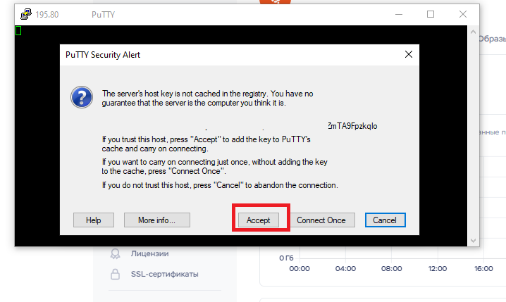

> _Gmailingizdan parolni oling Login odatda **root** bo'ladi :+1:_

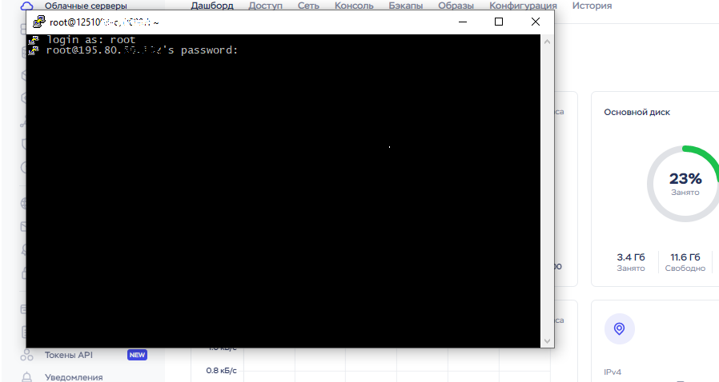

# _Keyingi bosqich_

> Ubuntu serverlariga loyihani yuklash deyarli bir xil xoxlasangiz WinSCP orqali . Bu qismlar bilan [Amazon](https://github.com/SaidqodirxonUz/forServer/blob/master/amazon/README.md) manzilda tanishishingiz mumkin

# _E'tiboringiz uchun rahmat_ Obuna bolishni unutmang [Telegram kanalimiz](https://t.me/KingsOfJS)

# Foydasi tegsa repository ga Star bosish esdan chiqmasin :)
